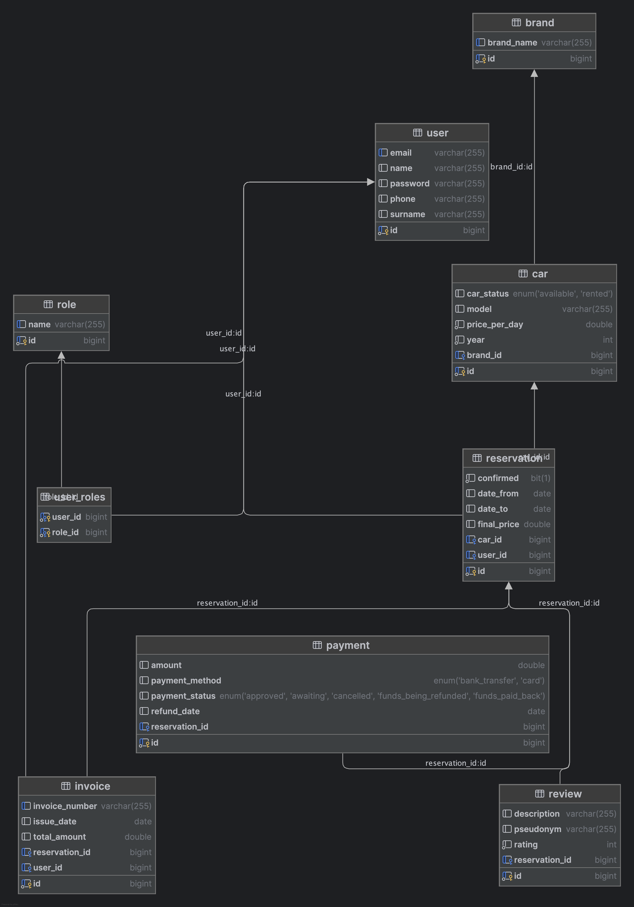

# 🚗 Car Rental Application with MySQL, Redis, Docker and Maven

A Spring Boot application that can be run both locally (via IntelliJ IDEA) and in Docker.  
It uses MySQL as the database and Redis for caching.  
Configuration is managed via `.env` file, `.application.yaml` file and separately configured profiles `dev` and
`docker`.
Built with Maven.

**Short description**  
Application dedicated for handling car reservations. Allows creating roles, brands, cars, reservations, invoices,
reviews and users and handle operations between them.
---

## 📋 Table of Contents

1. [About the Project](#about-the-project)
2. [Database Schema](#database-schema)
3. [Technologies](#technologies)
5. [Getting Started](#getting-started)
    - [Running Locally](#running-locally)
    - [Running from JAR](#running-from-jar)
    - [Running with Maven](#running-locally)
    - [Running with Docker](#running-with-docker)
7. [Caching with Redis](#caching-with-redis)
8. [API Examples](#api-examples)

---

## 📖About the Project

This project is a **Spring Boot** application that supports:

- Running locally via IntelliJ IDEA (or any IDE)
- Running in a Docker container
- Persistent storage with **MySQL**
- **Caching layer** using Redis
- External configuration via `.env` file

The goal is to provide a scalable backend with improved performance thanks to caching.

Features:

- [x] Add user roles
- [x] Add vehicle brands and models
- [x] Car reservations for customers
- [x] Creating payments for reservations
- [x] Changing status of the payment along with reservation and car status
- [x] Creating invoices
- [x] Generating invoices pdfs
- [x] Adding reviews
- [ ] Admin panel for fleet management

---

## 🗄Database Schema

Below is the entity-relationship diagram (ERD) for the MySQL database used in this project:



---

## Technologies

|
**Technology**        
|
**Version / Notes**              
|
|
-------------------
|
------------------------------
|
Java              
|
17+                          
|
|
Spring Boot       
|
3.x                          
|
|
MySQL             
|
8.x                          
|
|
Redis             
|
7.x                          
|
|
Maven             
|
3.9+                         
|
|
Docker + Compose

|
`.env`
support    
|
Spring Boot + dotenv plugin

---

## 🚀Getting Started

### 🖥Running Locally

1. **Clone the repository**

   ```bash
   git clone https://github.com/apreisne/

2. **Navigate to the project directory**

    ```bash
   cd [here goes project name]

3. **Configure environment variables**
   ```bash
    MYSQL_USER=
    MYSQL_PASSWORD=
    MYSQL_DATABASE=
    MYSQL_ROOT_PASSWORD=
    DB_PORT={host port}
    DB_HOST=localhost
    SPRING_DATASOURCE_URL=jdbc:mysql://mysql:{container port}/{your db name}
    SPRING_DATASOURCE_USERNAME=
    SPRING_DATASOURCE_PASSWORD=
    SPRING_REDIS_HOST=localhost
    SPRING_REDIS_PORT=6379
    TZ={your time zone}

### 🖥Running in IntelliJ IDEA

1. Open the project in **IntelliJ IDEA**.
2. Make sure you have Java 17+ configured in **Project SDK**.
3. Locate the main class annotated with `@SpringBootApplication`.
4. Right-click → **Run**.
5. Select the `dev` profile in **Run/Debug Configurations** if needed.

### 📦Running from JAR

1. First, package the application:

   ```bash
    mvn clean package
    java -jar target/app.jar

### **⚡Running with Maven (without building JAR)**

1. Make sure Maven is installed locally, then run:
   ```bash
    mvn spring-boot::run

### 🐳Running with Docker

1. **Build and start containers**

    ```bash
    docker compose up --build

2. **Services started:**

   Spring Boot App → http://localhost:8080

   MySQL → on port 3306

   Redis → on port 6379

3. **Stop containers**

    ```bash
   docker compose down -v

### ⚡Caching with Redis

**This application uses Redis for:**

- Caching frequently accessed data

- Reducing database load

- Improving response time

### API Examples


